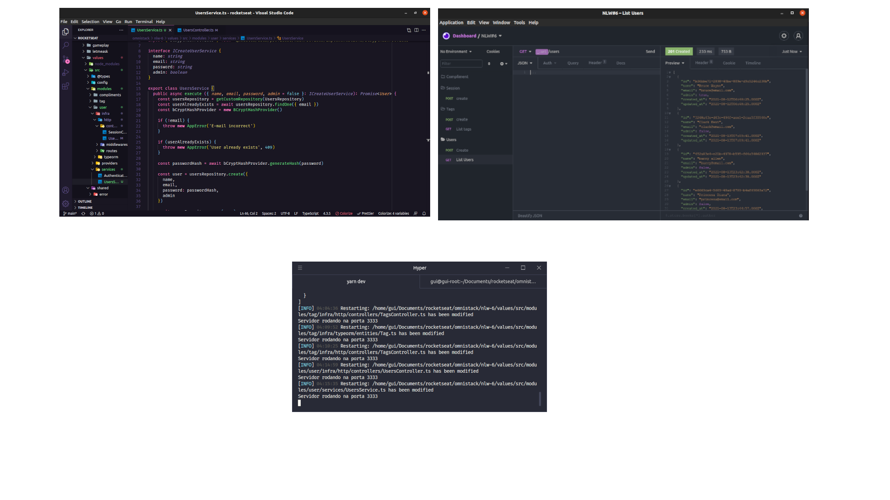

<h1 align="center">Valoriza</h1>

# 💻 Project

Valoriza é uma plataforma para promover o reconhecimento entre companheiros de equipe

##  ✨ Technologies used
  - [Node](https://nodejs.org)
  - [Typescript](https://www.typescriptlang.org)
  - [Express](https://expressjs.com)
  - [JSONWebToken](https://github.com/auth0/node-jsonwebtoken#readme)

# 🚀 How to run
## Install dependencies
  yarn install

## create the tables in the database
  yarn typeorm migration:run

## Run the app
  yarn dev

<!-- ### Request

`POST /settings`
`POST /users`
`POST /messages`
`GET /messages/:user_id`
`GET '/pages/client'`
`GET '/pages/admin'` -->

## 📄 Licença

This project is under the MIT license. See the file [LICENSE](LICENSE.md) for more details
